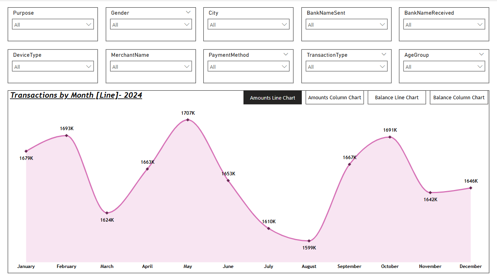
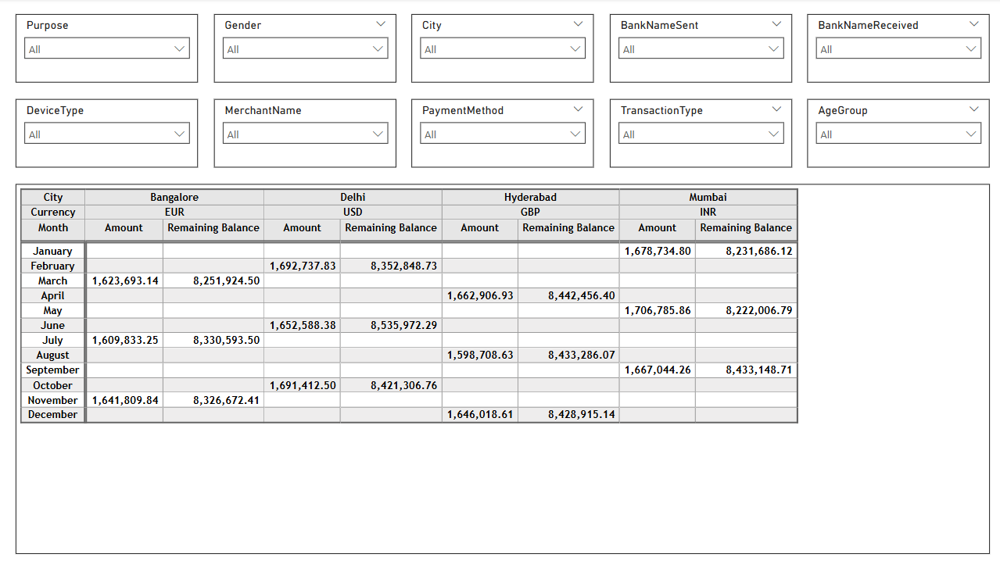

# UPI Transactions Data Analysis (Power BI)

## 📊 Project Overview
This Power BI dashboard analyzes UPI transaction data consisting of 20,000 unique records from January to December 2024. The dashboard provides insights into transaction trends by gender, device type, payment method, and purpose over time. Interactive filters and bookmarks make it easy to explore behavior across demographics and time periods.

---

## 📁 Dataset Features
- **Time Period**: January 2024 – December 2024 (1 year)
- **Rows**: 20,000 transactions
- **Key Features**:
  - TransactionID, TransactionDate, Amount, RemainingBalance
  - Gender, City, AgeGroup, CustomerAge
  - PaymentMethod, PaymentMode, DeviceType, TransactionType
  - BankNameSent, BankNameReceived
  - MerchantName, Purpose, Currency

---

## 🛠 Tools Used
- Power BI Desktop (.pbix)
- Bookmarks & Filters
- Pivot Table
- Area Charts & Column Charts

---

## 🔍 Dashboard Highlights

### 📈 Visuals Used:
- **Column & Area Charts**: Monthly transaction Amount and Remaining Balance
- **Pivot Table**: Monthly summary by City and Currency
- **Slicers/Filters**: Gender, Purpose, DeviceType, MerchantName, City, BankNameSent/Received, etc.
- **Bookmarks**: For seamless chart switching

### 📌 Insights:
- 📉 Decline in transactions via **Phone Number** for both genders  
- 📈 Rise in **UPI ID transactions** for females; **QR Code** for males  
- 🧳 Significant increase in travel-related transactions after **July–August**, especially for **IRCTC**
- 💻 Device trends:
  - **Males**: Shift from mobile/tablet to laptop
  - **Females**: Increase in mobile usage, decline via laptops/tablets

---

## 🖼️ Dashboard Preview

### Main Dashboard

### Pivot View

---

## 📌 Status
✅ Completed

---
